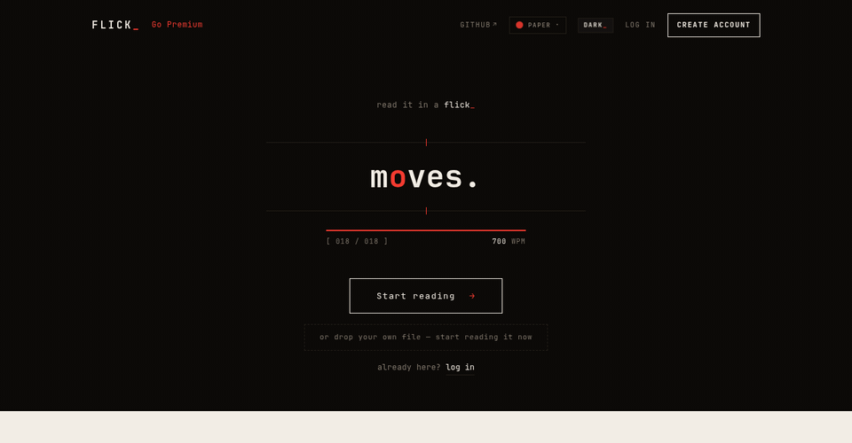
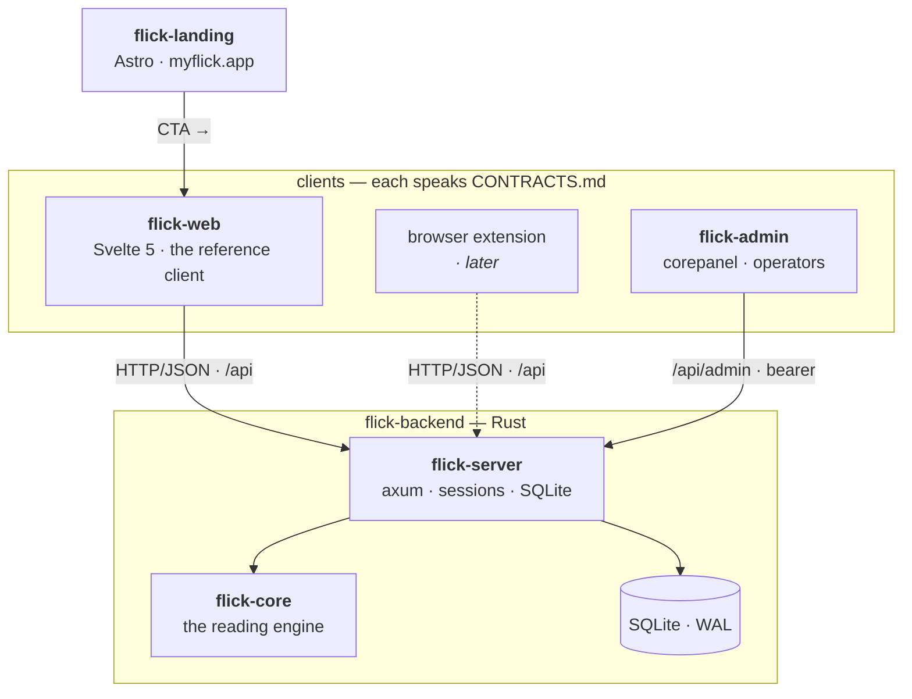

<div align="center">

# flick_

**read it in a flick** — a fast, open-source, self-hostable speed-reading app.

[**myflick.app**](https://myflick.app) · [self-host](#self-hosting) · [architecture](#how-it-works) · [contracts](docs/CONTRACTS.md) · [privacy](docs/legal/PRIVACY.md)

[](https://github.com/one-more-refactor/flick/actions/workflows/versions.yml)
[](LICENSE)
[](#self-hosting)
[](#how-your-reading-syncs)



</div>

## Quick start

**Use it now — nothing to install:** [**myflick.app**](https://myflick.app) — guest-first, read in one tap, free.

**Self-host it — one command, one container, no external services:**

```sh
curl -fsSL https://myflick.app/install.sh | sh
```

→ open **http://localhost:8484**. Your library lives in a named volume; re-run to upgrade in place. Add `--with-admin` for the [operator panel](https://github.com/one-more-refactor/flick-admin) on `:8485`.

<sub>Prefer to read the script first? It's [`install.sh`](install.sh) — or clone and `docker compose up -d`. Podman, SMTP, SSO, and reverse-proxy options are in [**docs/SELF-HOSTING.md**](docs/SELF-HOSTING.md).</sub>

## What is flick?

One word at a time, each anchored on the **red pivot letter your eye locks onto** — RSVP reading with Optimal-Recognition-Point alignment, comfortable well past 400 WPM. And flick *paces*, not flashes: rare words linger, common ones fly, long words split, sentences breathe.

- **Guest-first.** Read in one tap, no account. Sign up later — your library follows you.
- **Your whole library.** Paste, PDF, EPUB, `.txt`, Kindle clippings, or a URL.
- **A habit.** Streaks, a daily goal, real stats, a year-in-review.
- **Yours.** AGPL-3.0, self-hostable in one command, IPs pseudonymised, delete/export built in.

**Try it:** [**myflick.app**](https://myflick.app) (hosted, free) — or [self-host](#self-hosting) in one command.

## How it works

Contracts-first: [`docs/CONTRACTS.md`](docs/CONTRACTS.md) is the one binding document — timeline format, HTTP API, config, design tokens. Every part speaks it and nothing else; change the contract in the same PR, first commit.



The engine (`flick-core`) is pure and deterministic — text in, paced timeline out: ORP pivot fixed in place, [Zipf](https://en.wikipedia.org/wiki/Zipf%27s_law)-frequency weighting, long-word chunking, wrap-up pauses. Clients never reimplement it — they play timelines on a frame-accurate rAF scheduler.

### How your reading syncs

1. **Guest.** First visit mints a guest session (a cookie); your library and position live server-side. Nothing lost on refresh.
2. **Merge on sign-up.** Create an account from a guest session and the guest's books and progress merge into it.
3. **Checkpoints.** The reader saves your position every ~5 s while playing, on pause, and on exit — reopen anywhere, you're at the exact word.
4. **One store.** Everything is one SQLite file (WAL) with FK cascades — deleting your account really deletes your data.

### Editions

*What's free stays free.* Self-host = everything, no limits, forever. Hosted = a free tier plus Pro to fund the project — never the other way around.

## Self-hosting

One SQLite file, one container, no external services:

```sh
curl -fsSL https://raw.githubusercontent.com/one-more-refactor/flick/master/install.sh | sh
```

…or `git clone https://github.com/one-more-refactor/flick.git && cd flick && docker compose up -d` → http://localhost:8484. Add `--with-admin` (installer) or `--profile admin` (compose) for the [operator panel](https://github.com/one-more-refactor/flick-admin) on :8485. Full options (SMTP, SSO, reverse proxy, Podman/Quadlet) in [**docs/SELF-HOSTING.md**](docs/SELF-HOSTING.md).

## The repos

Small, single-purpose repos, one contract. Every repo tests on every push, and tagging `vX.Y.Z` gates the release: CI verifies the tag matches the manifest, runs the full suite, and only then publishes. The badges track each repo's drift from its newest release; the umbrella's nightly [versions workflow](.github/workflows/versions.yml) fails loudly if any manifest and release fall out of step.

| Repo | What it is | Release | Drift | CI |
|---|---|---|---|---|
| **flick** (this one) | Umbrella: docs, [contract](docs/CONTRACTS.md), installer, Compose, [legal](docs/legal). | — | — | [](https://github.com/one-more-refactor/flick/actions/workflows/versions.yml) |
| [**flick-backend**](https://github.com/one-more-refactor/flick-backend) | Rust — engine (`flick-core`) + API server (`flick-server`). | [](https://github.com/one-more-refactor/flick-backend/releases/latest) |  | [](https://github.com/one-more-refactor/flick-backend/actions/workflows/ci.yml) |
| [**flick-web**](https://github.com/one-more-refactor/flick-web) | Svelte 5 web client — the reference implementation. | [](https://github.com/one-more-refactor/flick-web/releases/latest) |  | [](https://github.com/one-more-refactor/flick-web/actions/workflows/ci.yml) |
| [**flick-landing**](https://github.com/one-more-refactor/flick-landing) | Astro marketing site behind [myflick.app](https://myflick.app). | [](https://github.com/one-more-refactor/flick-landing/releases/latest) |  | [](https://github.com/one-more-refactor/flick-landing/actions/workflows/ci.yml) |
| [**flick-admin**](https://github.com/one-more-refactor/flick-admin) | The server admin panel — analytics, users, events, announcements. | [](https://github.com/one-more-refactor/flick-admin/releases/latest) |  | [](https://github.com/one-more-refactor/flick-admin/actions/workflows/ci.yml) |
| [**corepanel**](https://github.com/one-more-refactor/corepanel) | The generic admin-panel toolkit flick-admin is built on (MIT). | [](https://github.com/one-more-refactor/corepanel/releases/latest) |  | [](https://github.com/one-more-refactor/corepanel/actions/workflows/ci.yml) |
| *flick-…* | More clients (browser extension, …) land as their own repos. | | | |

## Privacy & the law

Privacy by design: pseudonymised IPs, no ad tech, one-click **export** (GDPR Art. 15/20) and **deletion** (Art. 17). Because the hosted service is an AGPL §13 network service, its complete source is these repos — run a modified flick as a service and you owe your users the same. See [PRIVACY](docs/legal/PRIVACY.md) · [TERMS](docs/legal/TERMS.md) · [legal review](docs/legal/LEGAL-REVIEW.md).

## Contributing

Small on purpose; the house style is strict and load-bearing: **monospace, square corners, one accent, no gradients / glows / shadows.** Read [CONTRIBUTING.md](CONTRIBUTING.md) + [CONTRACTS.md](docs/CONTRACTS.md); open an issue before a feature PR.

## License

[**AGPL-3.0-only**](LICENSE). The marketing site is MIT. Bundled-data attribution in [NOTICE](NOTICE).
