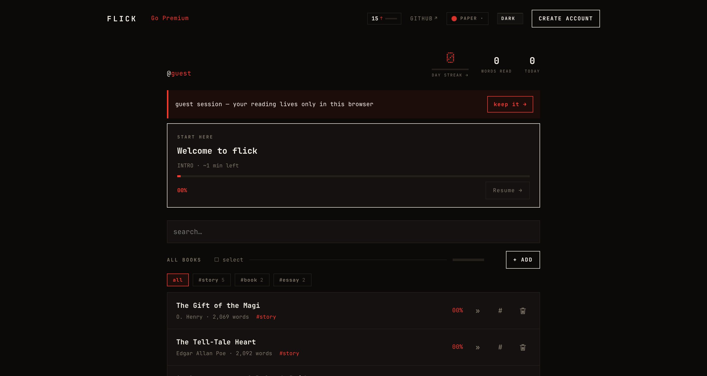
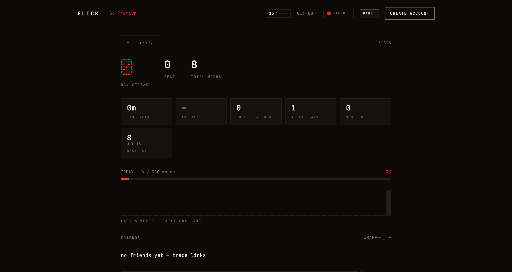
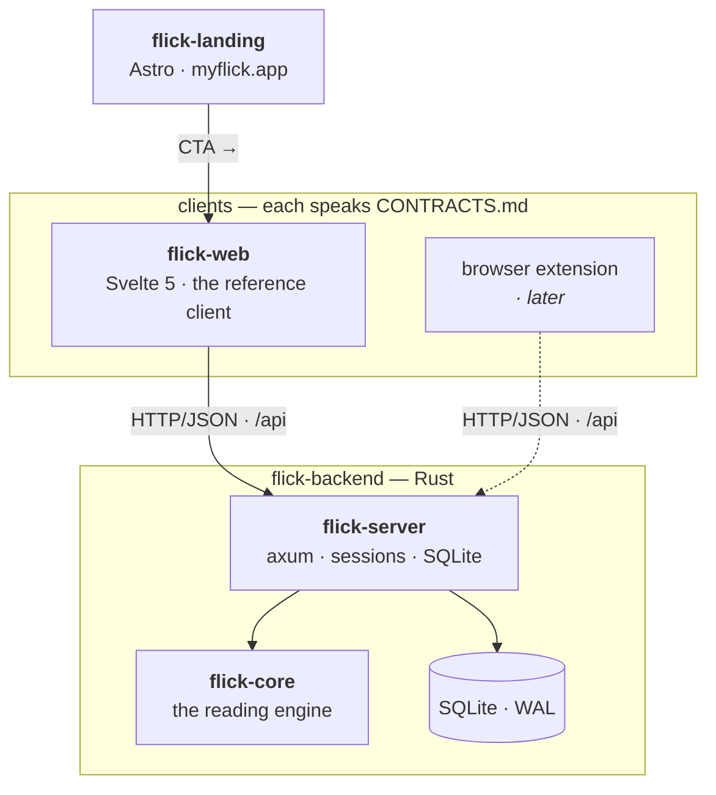

<div align="center">

# flick_

**read it in a flick** — a fast, open-source, self-hostable speed-reading app.

[**myflick.app**](https://myflick.app) · [self-host](#self-hosting) · [architecture](#how-it-works) · [contracts](docs/CONTRACTS.md) · [privacy](docs/legal/PRIVACY.md)

[](LICENSE)
[](#self-hosting)
[](#how-your-reading-syncs)


</div>

## What is flick?

flick shows you one word at a time, each anchored on the **red pivot letter your eye locks onto** — so your gaze never has to move. That's RSVP reading with **Optimal Recognition Point** alignment, and it's comfortable well past 400 WPM.

But a gimmick that flashes words isn't enough. flick *paces* them: rare words linger, common ones fly, long words split, sentences breathe. The result reads like thought, not a metronome.

- **Guest-first.** Start reading in one tap — no account. Sign up later and your library follows you.
- **Your whole library.** Paste, PDF, EPUB, `.txt`, Kindle clippings, or a URL. Documents you need to get through and books you love — same engine, same shelf.
- **A habit, not a party trick.** Day streaks, a daily goal, real stats, a year-in-review.
- **Yours.** Open source (AGPL-3.0), self-hostable in one command, privacy-first — IPs are pseudonymised, and account deletion + data export are first-class.

## Try it

|  | |
|---|---|
| **Hosted** | [**myflick.app**](https://myflick.app) — free, no account needed. |
| **Self-host** | One command → [jump to Self-hosting](#self-hosting). Everything free. |

<table>
<tr>
<td width="50%"><br><em>Your library — seeded with public-domain classics.</em></td>
<td width="50%"><br><em>Streaks, goals, and reading stats.</em></td>
</tr>
</table>

## How it works

flick is **contracts-first**: [`docs/CONTRACTS.md`](docs/CONTRACTS.md) is the single binding document for the timeline format, the HTTP API, server config, and the design tokens. Every part of the system — the server, the web client, a future browser extension — speaks that contract and nothing else. Change the contract in the same PR as the code, first commit; code follows the document, never the other way around.



### The reading engine

The engine ([`flick-core`](https://github.com/one-more-refactor/flick-backend)) is pure and deterministic — text in, a paced timeline out. Each word earns its dwell time from a research-grounded model:

- **ORP alignment** — every word is split at its optimal recognition point and rendered with that pivot fixed in place. No line-tracking, no saccades.
- **Frequency weighting** — rarer words (low [Zipf](https://en.wikipedia.org/wiki/Zipf%27s_law) score) get more time; common words flick by.
- **Length grading & long-word splitting** — long tokens are chunked, each chunk paced on its own.
- **Wrap-up pauses** — clause- and sentence-final punctuation gets a beat, so meaning lands.

Clients never reimplement any of this — they play timelines. Playback is a `requestAnimationFrame`-accumulator scheduler (frame-accurate; never `setTimeout` drift).

### How your reading syncs

flick is designed so reading follows you without ever forcing an account:

1. **Guest.** Your first visit mints a guest session (a cookie). Your library and position live server-side, keyed to that guest — no signup, nothing lost on refresh.
2. **Merge on sign-up.** When you create an account (or sign in) from a guest session, that guest's books and progress **merge into your account**.
3. **Checkpoint while you read.** The reader reports your position and words-read to the server **every ~5 seconds while playing**, and on pause and on exit. Reopen any book, on any device, and you're at the exact word you left.
4. **One store.** Everything is SQLite (WAL) — books, text, reading days, sessions, friends — with foreign-key cascades, so deleting your account really deletes your data.

### Editions

| | **self-host** | **hosted** (myflick.app) |
|---|---|---|
| Price | free — everything | Free tier + Pro |
| Limits | none | generous free limits |
| SSO, imports, stats | all included | all included |

*What's free stays free.* The hosted service exists to fund the project; the self-host edition is never a crippled version of it.

## Self-hosting

One SQLite file, one container, no external services.

```sh
curl -fsSL https://raw.githubusercontent.com/one-more-refactor/flick/master/install.sh | sh
```

…or clone and use Compose directly:

```sh
git clone https://github.com/one-more-refactor/flick.git
cd flick
docker compose up -d          # → http://localhost:8484
```

The first build compiles the Rust server and the Svelte client into one image; after that it's instant. Full options (SMTP for email login, Google/GitHub/OIDC SSO, reverse-proxy and Podman/Quadlet notes) are in [**docs/SELF-HOSTING.md**](docs/SELF-HOSTING.md).

## The repos

flick is split into small, single-purpose repos that all speak the same contract:

| Repo | What it is |
|---|---|
| **flick** (this one) | The umbrella: docs, the [API contract](docs/CONTRACTS.md), the installer, Compose, and [legal](docs/legal). |
| [**flick-backend**](https://github.com/one-more-refactor/flick-backend) | Rust — the reading engine (`flick-core`) and the API server (`flick-server`). |
| [**flick-web**](https://github.com/one-more-refactor/flick-web) | The Svelte 5 web client — the reference implementation of the contract. |
| [**flick-landing**](https://github.com/one-more-refactor/flick-landing) | The Astro marketing site behind [myflick.app](https://myflick.app) (hosted-only). |
| *flick-…* | More clients (browser extension, …) land as their own repos over time. |

## Privacy & the law

flick is built to be run in public without lawyering it every week:

- **Privacy by design** — client IPs are pseudonymised before storage; there's no ad tech.
- **Your data is yours** — one-click **data export** (GDPR Art. 15/20) and **account deletion** (Art. 17).
- **AGPL §13** — because the hosted service is a network service, its complete source is these repos. Run a modified flick as a service and you owe your users the same.

See [PRIVACY](docs/legal/PRIVACY.md), [TERMS](docs/legal/TERMS.md), and the [legal review](docs/legal/LEGAL-REVIEW.md).

## Contributing

Small on purpose — the house style is strict and load-bearing: **monospace, square corners, one accent colour, no gradients / glows / shadows.** Read [CONTRIBUTING.md](CONTRIBUTING.md) and [CONTRACTS.md](docs/CONTRACTS.md) first; open an issue before a feature PR.

## License

[**AGPL-3.0-only**](LICENSE). The marketing site ([flick-landing](https://github.com/one-more-refactor/flick-landing)) is MIT. Attribution for bundled data (word-frequency tables, public-domain texts) is in [NOTICE](NOTICE).
