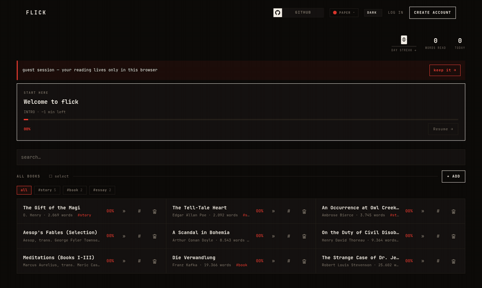
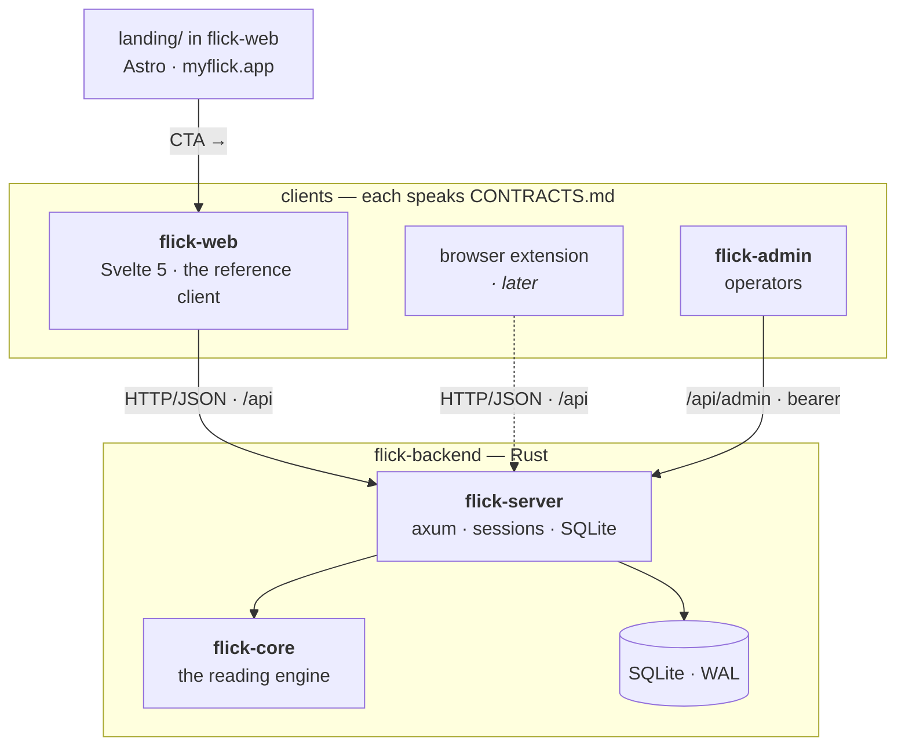

<div align="center">

# flick_

**read it in a flick** — self-hosted speed reading for PDFs, EPUBs and your read-later pile.

[**myflick.app**](https://myflick.app) · [self-host](#self-host) · [architecture](#how-it-works) · [the research](https://myflick.app/science/) · [contracts](docs/CONTRACTS.md)

[](LICENSE)
[](#self-host)
[](#how-it-works)
[](https://github.com/one-more-refactor/flick/actions/workflows/versions.yml)



</div>

## Try it

**Hosted, nothing to install:** [**myflick.app**](https://myflick.app) — read in one tap, no account.

## Self-host

One command, one container, one SQLite file. No Redis, no Postgres, no external services.

```sh
curl -fsSL https://myflick.app/install.sh | sh
```

→ **http://localhost:8484**. Your library lives in a named volume; re-run to upgrade in place.

<sub>Read the script first: [`install.sh`](install.sh). Or clone and `docker compose up -d`. Add `--with-admin` for the [operator panel](https://github.com/one-more-refactor/flick-admin) on `:8485`. SMTP, SSO, reverse proxy and Podman/Quadlet in [**docs/SELF-HOSTING.md**](docs/SELF-HOSTING.md).</sub>

## What it is

One word at a time, each anchored on the **red pivot letter your eye locks onto** — RSVP reading with Optimal-Recognition-Point alignment. It *paces* rather than flashes: rare words linger, common ones fly, long words split, sentences breathe.

- **Guest-first** — read in one tap; sign up later and your library follows you.
- **Your whole library** — paste, PDF, EPUB, `.txt`, Markdown, Kindle clippings, a URL.
- **A habit** — streaks, a daily goal, real stats, a year-in-review.
- **Yours** — AGPL-3.0, self-hostable in one command, pseudonymised IPs, export and delete built in.

> **The honest part:** RSVP removes eye movement, not attention. Most readers settle around 400–500 wpm; comprehension degrades as the rate climbs, and dense text still wants a second pass — which flick is built for. [What the research actually says →](https://myflick.app/science/)

## How it works

Contracts-first: [`docs/CONTRACTS.md`](docs/CONTRACTS.md) is the one binding document — timeline format, HTTP API, config, design tokens. Every part speaks it and nothing else.


```mermaid
flowchart TD
    subgraph clients["clients — each speaks CONTRACTS.md"]
        web["<b>flick-web</b><br/>Svelte 5 · the reference client"]
        ext["browser extension<br/><i>· later</i>"]
        admin["<b>flick-admin</b><br/>operators"]
    end
    landing["landing/ in flick-web<br/>Astro · myflick.app"]

    web -- "HTTP/JSON · /api" --> server
    ext -. "HTTP/JSON · /api" .-> server
    admin -- "/api/admin · bearer" --> server
    landing -- "CTA →" --> web

    subgraph backend["flick-backend — Rust"]
        server["<b>flick-server</b><br/>axum · sessions · SQLite"]
        core["<b>flick-core</b><br/>the reading engine"]
        db[("SQLite · WAL")]
        server --> core
        server --> db
    end
```

`flick-core` is pure and deterministic — text in, paced timeline out: ORP pivot fixed in place, [Zipf](https://en.wikipedia.org/wiki/Zipf%27s_law)-frequency weighting, long-word chunking, wrap-up pauses. Clients never reimplement it; they play timelines on a frame-accurate rAF scheduler, so changing WPM never needs a round trip.

Your position is server-side from the first visit — a guest session mints immediately, merges into your account when you sign up, and checkpoints every ~5 s. It's all one SQLite file with FK cascades, so deleting your account really deletes your data.

*What's free stays free.* Self-host is everything, forever; hosted adds Pro to fund the project — never the other way around.

## The repos

Small, single-purpose, one contract. Every repo tests on every push; tagging `vX.Y.Z` gates the release, and the nightly [versions workflow](.github/workflows/versions.yml) fails loudly if a manifest and its release drift apart.

| Repo | What it is | Release |
|---|---|---|
| **flick** (this one) | Umbrella: docs, [contract](docs/CONTRACTS.md), installer, Compose, [legal](docs/legal) | [](https://github.com/one-more-refactor/flick/releases/latest) |
| [**flick-backend**](https://github.com/one-more-refactor/flick-backend) | Rust — engine (`flick-core`) + API server (`flick-server`) | [](https://github.com/one-more-refactor/flick-backend/releases/latest) |
| [**flick-web**](https://github.com/one-more-refactor/flick-web) | Svelte 5 web client — the reference implementation, marketing landing included as a native i18n'd view | [](https://github.com/one-more-refactor/flick-web/releases/latest) |
| [**flick-admin**](https://github.com/one-more-refactor/flick-admin) | Operator panel — analytics, users, events, announcements (the corepanel toolkit lives in-tree since 1.1) | [](https://github.com/one-more-refactor/flick-admin/releases/latest) |

## Privacy, licence, contributing

Pseudonymised IPs, no ad tech, one-click **export** (GDPR Art. 15/20) and **deletion** (Art. 17) — [PRIVACY](docs/legal/PRIVACY.md) · [TERMS](docs/legal/TERMS.md). The hosted service is an AGPL §13 network service, so its complete source is these repos: run a modified flick as a service and you owe your users the same.

[**AGPL-3.0-only**](LICENSE) (the marketing site is MIT; bundled-data attribution in [NOTICE](NOTICE)). House style is strict and load-bearing — **monospace, square corners, one accent, no gradients, glows or shadows.** Read [CONTRIBUTING.md](CONTRIBUTING.md) and [CONTRACTS.md](docs/CONTRACTS.md), and open an issue before a feature PR.
