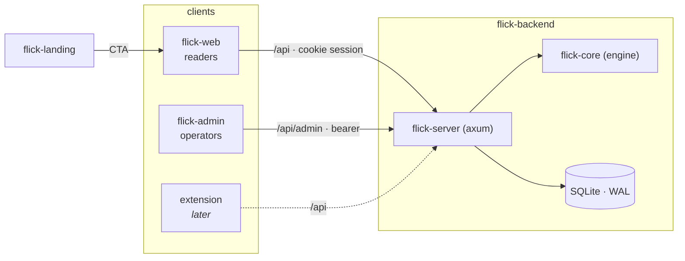
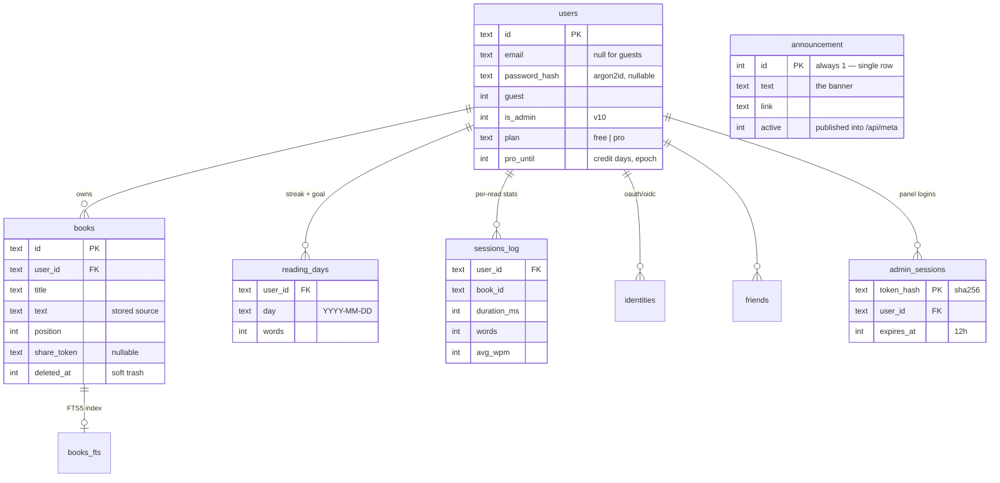
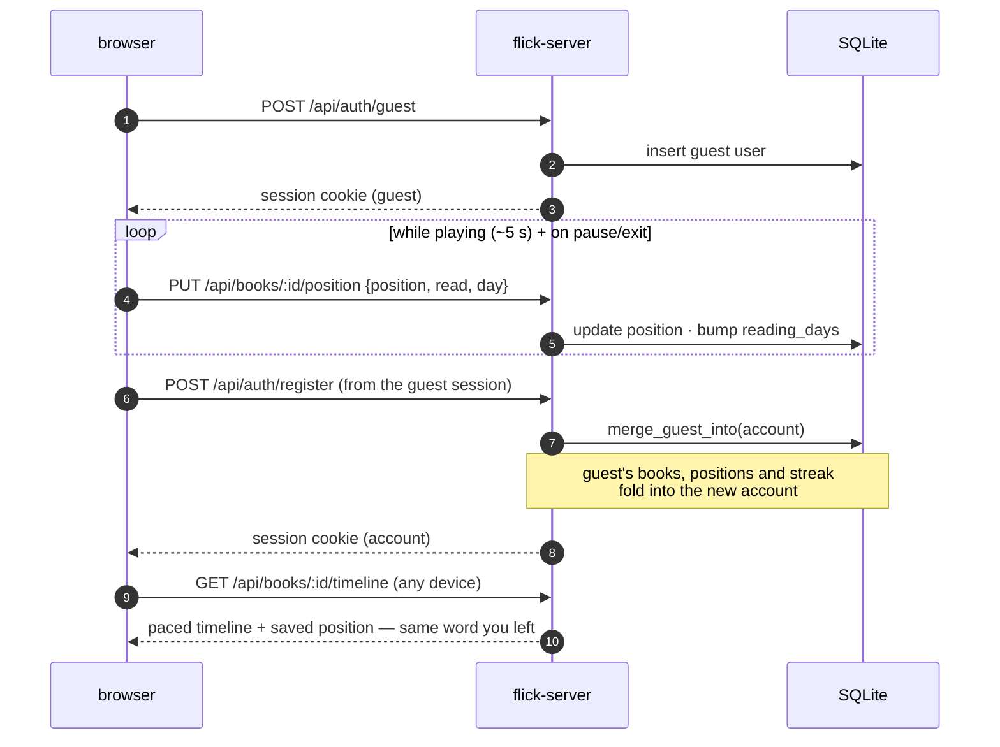
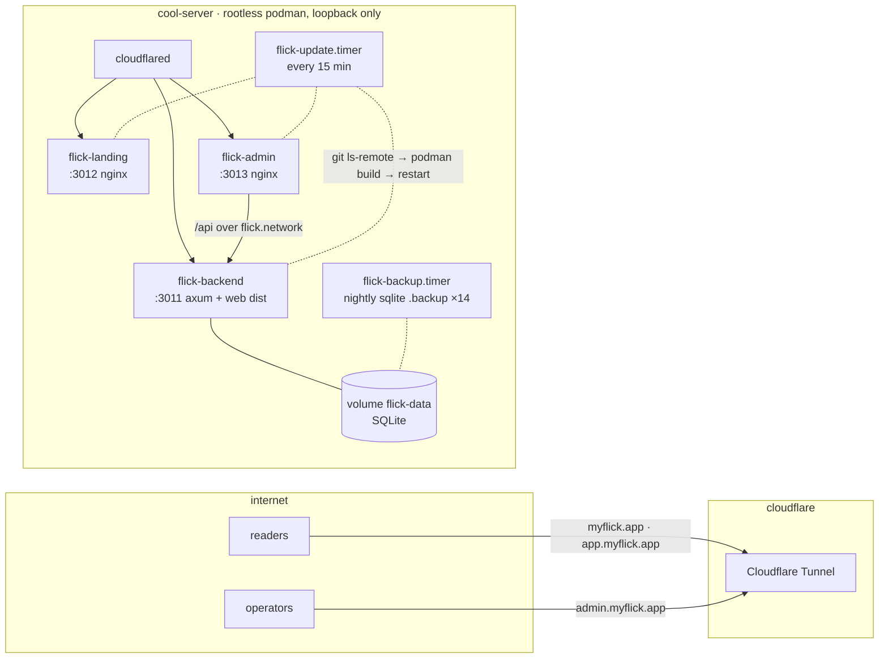

# Architecture

How flick is put together, and how the pieces talk. The binding spec for the
formats and endpoints named here is [CONTRACTS.md](CONTRACTS.md); this document
is the map, that one is the law.

## One contract, many clients

flick is **contracts-first**. [`CONTRACTS.md`](CONTRACTS.md) defines the reading
**timeline** format, the **HTTP API**, **server config**, and the **design
tokens**. The server implements it; every client consumes it; no client
reimplements engine logic. Add a client (browser extension, mobile app) and it
plugs into the same API — the backend doesn't change.

```
one-more-refactor/
├── flick           umbrella — docs, contract, installer, compose, legal   (this repo)
├── flick-backend   Rust — flick-core (engine) + flick-server (axum API)
├── flick-web       Svelte 5 — the reference web client
├── flick-admin     the server admin panel (own service, own port)
├── corepanel       generic admin-panel toolkit flick-admin is built on (MIT)
└── flick-landing   Astro — the marketing site (myflick.app, hosted-only)
```



## Request lifecycle

In production one image serves everything on one origin: the web client at `/`,
the JSON API under `/api`.

```
browser ─▶ GET /                 → flick-server serves the built web client (ServeDir)
        ─▶ POST /api/auth/guest  → mint guest user + session cookie
        ─▶ GET  /api/books       → library JSON  (cookie → AuthUser extractor)
        ─▶ GET  /api/books/:id/timeline → flick-core turns text into a paced timeline
        ─▶ PUT  /api/books/:id/position → checkpoint while reading
```

- **Sessions** are signed cookies; an `AuthUser` extractor resolves the cookie
  to a user (guest or full) on every guarded route.
- **The client never computes pacing.** It requests a *timeline* — a list of
  words with per-word dwell weights and ORP pivots — and plays it with a
  `requestAnimationFrame` accumulator (frame-accurate, no `setTimeout` drift).

## The engine (`flick-core`)

Pure, deterministic, no I/O — which is why it's heavily unit-tested. The
pipeline, per word:

1. **Tokenise** text into words + trailing punctuation.
2. **ORP** — pick the optimal recognition point (the pivot letter) and split the
   word around it so the pivot renders in a fixed column.
3. **Weight** the dwell time from: base WPM, **Zipf frequency** (rarer = longer),
   **length** (graded, with long words split into chunks), and **wrap-up**
   pauses after clause/sentence punctuation.
4. Emit a **timeline**: `[{ pre, pivot, post, ms }, …]`.

Change any of this and you change `CONTRACTS.md` in the same commit.

## Data model

Everything is one **SQLite** database (WAL mode) via `rusqlite` (bundled — no
system SQLite). Schema versions advance through `PRAGMA user_version`
migrations (v10 today). Core tables:



Foreign keys cascade on user delete, so **account deletion removes everything**
(GDPR Art. 17). `login_codes` are keyed by email and swept separately.

## How reading syncs

The design goal: reading follows you, and you never *have* to sign up.



## Editions

`FLICK_EDITION` selects behaviour: `selfhost` (everything free, nothing metered)
or `hosted` (Free tier + Pro on myflick.app). Same binary, same features — the
edition only governs limits and billing surface.

## Admin surface

The panel is a separate client on a separate origin
([flick-admin](https://github.com/one-more-refactor/flick-admin), built on
[corepanel](https://github.com/one-more-refactor/corepanel)); the server side is
`/api/admin/*` — bearer-only (env token or 12 h admin sessions of `is_admin`
users), 404 until either exists. What it manages: analytics aggregates, users,
events, and the announcement banner that `/api/meta` hands to every visitor.

## Deployment

The production image (`flick-backend/deploy/Containerfile`) builds the Svelte
client from `flick-web`, the Rust server from `flick-backend`, and bakes them
into one Debian-slim runtime. On [myflick.app](https://myflick.app) everything
runs rootless (Podman + systemd Quadlet) on loopback behind a Cloudflare
Tunnel — no ports exposed:



Updates are **pull-based**: [`deploy/cool-server/update.sh`](../deploy/cool-server/update.sh)
polls the public repos, rebuilds the affected image from the git URL (a
`flick-web` push rebuilds the backend image, which bakes the client in), and
only restarts a unit after a successful build. Self-hosters get the same
images via [Compose](../docker-compose.yml) — see [SELF-HOSTING.md](SELF-HOSTING.md).
